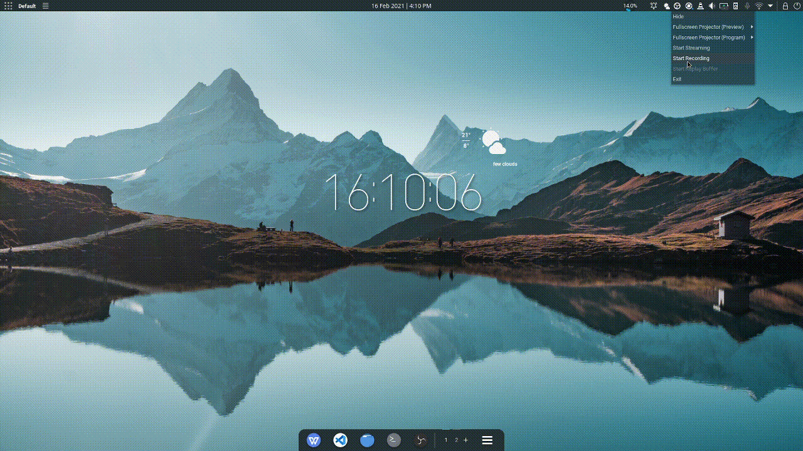

# Appnativefy 

Appnativefy is an NPM package to make executable AppImage files from any website, it uses the Nativefier API in the backend, with AppImageKIt. 

---

[](https://badge.fury.io/js/appnativefy)


            |  Make a native AppImage for ANY website
 :-------------------------------:|:-----------------------------------------:
## Installation
```bash
npm install -g appnativefy
```
## Supported platforms & prerequisites
### Supported platforms
Supported for: GNU/Linux Operating Systems
Architectures: amd64
(Soon adding support for additional architectures)

### Prerequisites
* Node.JS
* NPM Package manager
* Wget

You can install these by:
#### Debian and derivatives (Ubuntu, Kubuntu, KDE Neon, Kali, etc.)
```bash
sudo pkcon update (for KDE Neon) | sudo apt-get update (for all other distros)
sudo apt-get install nodejs npm wget
```
#### Arch and derivatives (Garuda, Manjaro, etc.)
```bash
sudo pacman -Syu
sudo pacman -S nodejs npm wget
```
### Usage

For example, to make an AppImage for YouTube, simply run, `appnativefy --name "YouTube" --url "https://youtube.com"`
But if you wish to sign-in to YouTube, pass `--services`, this argument enables to sign-in using services such as Microsoft 365 and Google, in sites that support them. So, you'll be supposed to run `appnativefy --name "YouTube" --url "https://youtube.com" --services`

Generally the command is:
`appnativefy --name <value> --url <website url> <additional options>`

It is recommended to pass the values inside double quotes `" "`, so that it may not cause any errors. Also, whitespaces in the value of `--name` will be replaced with hyphens `-`. This means, if the name is supplied as `--name "Hello world"`, it will change into `Hello-world`.

The built AppImage will be found in `~/AppImage-maker`, with the file name: `<name>-x86_64.AppImage`
#### List of options
* --version | -V
```appnativefy -
--- 
