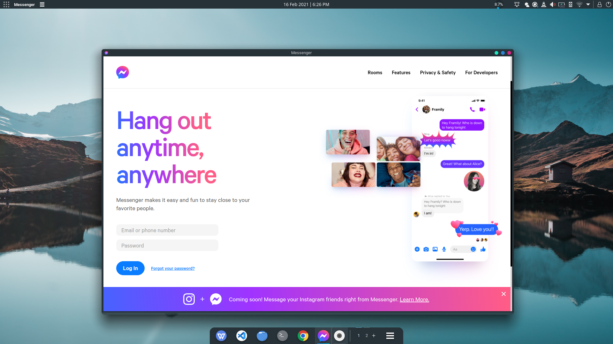

# Appnativefy 

Appnativefy is an NPM package to make executable AppImage files from any website, it uses the Nativefier API in the backend, with AppImageKIt. 

## Why AppImages?

AppImages are cross-distro unlike `.deb` or .`rpm`. Plus, you dont have to face the hassle of individually installing the package, and another hassle while uninstalling.

With AppImages, there's no installation required, click-to-run.

Uninstall? `rm -r <file name>.AppImage`
Simply delete the file.

---

[](https://badge.fury.io/js/appnativefy)


**Make a native AppImage for ANY website**
<br>
    


## Installation
```bash
npm install -g appnativefy
```
## Supported platforms & prerequisites
### Supported platforms
Supported for: GNU/Linux Operating Systems

Architectures: amd64
(Soon adding support for additional architectures)

### Prerequisites
* Node.JS
* NPM Package manager
* Wget

You can install these by:
#### Debian and derivatives (Ubuntu, Kubuntu, KDE Neon, Kali, etc.)
```bash
sudo pkcon update (for KDE Neon) | sudo apt-get update (for all other distros)
sudo apt-get install nodejs npm wget
```
#### Arch and derivatives (Garuda, Manjaro, etc.)
```bash
sudo pacman -Syu
sudo pacman -S nodejs npm wget
```
#### Gentoo
```bash
emerge nodejs wget
```

## Usage

For example, to make an AppImage for YouTube, simply run, 
```
appnativefy --name "YouTube" --url "https://youtube.com"
```
But if you wish to sign-in to YouTube, pass `--services`, this argument enables to sign-in using services such as Microsoft 365 and Google, in sites that support them. So, you'll be supposed to run 
```
appnativefy --name "YouTube" --url "https://youtube.com" --services
```

Generally the command is:
```
appnativefy --name <value> --url <website url> <additional options>
```

It is recommended to pass the values inside double quotes `" "`, so that it may not cause any errors. Also, whitespaces in the value of `--name` will be replaced with hyphens `-`. This means, if the name is supplied as `--name "Hello world"`, it will change into `Hello-world`.

The built AppImage will be found in `~/appnativefy`, with the file name: `<name>-x86_64.AppImage`
#### List of options
* --help | -h
```
appnativefy --help, appnativefy -h
```
Prints possible command-line options

* --version | -V

```
appnativefy --version, appnativefy -V
```
Prints the installation directory and version of installed appnativefy

* --name | -n [REQUIRED]
```
--name <value>,-n <value>
```
To specify the name of the AppImage to be built, `---url | -u` and `--name | -n` are required options, also, it is recommended to enclose the values using doublequotes `" "`.

* --url | -u [REQUIRED]
```
--url <value>, -u <value>
```
URL of the website, that is to be nativefied.

* --internalurls
```
--internalurls <REGEX>
```
Regular expression for internal URLs.

* --appCopyright
```
--appCopyright <value>
```
 Copyright information
 
 * --appVersion 
 ```
 --appVersion <value>
 ```
 App version info

* -e, --electronVersion
```
-e, --electronVersion <value without the "v">
```
Specifies which version of electron framework to be used by the AppImage.

* --saveAs
```
--saveAs
```
Shows a "Save As" dialog while downloading.

* --favicon
```
--favicon
```
Forces to use the favicon of the site while making the AppImage. If not specified in certain cases, the icon may be different than expected in sites such as Microsoft Teams.

* --widevine
```
--widevine
```
Adds Widevine support to the AppImage, to enable playing DRM enabled content in sites such as Spotify.

* --services
```
--services
```
**NOTE**: If passed without `--internalurls` will default to `(.*)` as internal URLs.

Changes the useragent to `Mozilla/5.0 (X11; Ubuntu; Linux x86_64; rv:85.0) Gecko/20100101 Firefox/85.0` to overcome incompatibilty with Microsoft 365 and/or Google sign-in services.

* --noOverwrite
```
--noOverwrite
```
Specifies that the directory should not be overwritten if already present.

* --conceal
```
--conceal
```
Conceals the sourcecode of the electronized website inside the AppImage into an ASAR archive.


* --counter
```
--counter
```
Use a counter that persists even with window focus for the application badge.

* --singleinstance
```
--singleinstance
```
Only a single instance of the AppImage will execute, if already running, the instance will be brought to front.

* --disablegpu
```
--disablegpu
```
Disables hardware acceleration, in the AppImage.

## Examples


### Google
```
appnativefy --name "Google" --url "https://google.com" --services
```
https://github.com/sarweshparajuli/appnativefy-gifs/raw/main/examples/Google-x86_64.AppImage

### Messenger
```
appnativefy --name "Messenger" --url "https://messenger.com" --services --favicon
```
https://github.com/sarweshparajuli/appnativefy-gifs/raw/main/examples/Messenger-x86_64.AppImage
### Microsoft Teams
```
appnativefy --name "Microsoft Teams" --url "https://teams.microsoft.com/_" --services --favicon
```
https://github.com/sarweshparajuli/appnativefy-gifs/raw/main/examples/Microsoft-Teams-x86_64.AppImage
### Spotify
```
appnativefy --name "Spotify" --url "https://open.spotify.com" --services --widevine --favicon
```
https://github.com/sarweshparajuli/appnativefy-gifs/raw/main/examples/Spotify-x86_64.AppImage
### YouTube
```
appnativefy --name "YouTube" --url "https://youtube.com" --services
```
https://github.com/sarweshparajuli/appnativefy-gifs/raw/main/examples/YouTube-x86_64.AppImage

--- 
